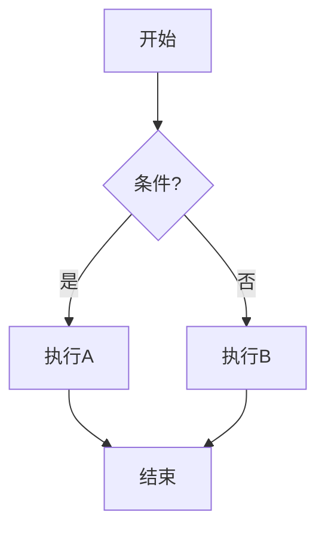

# 绘图工具

## 文本画图 (推荐，适合程序员)

### Mermaid — Markdown 内嵌



支持：流程图、时序图、类图、状态图、ER图、甘特图。
GitHub/GitLab 直接渲染，最适合写文档。

### PlantUML — 最全能

```
@startuml
User -> App: 登录
App -> DB: 查询
DB --> App: 返回
App --> User: 成功
@enduml
```

支持所有 UML 图 + 架构图。

### Graphviz DOT — 节点关系图


## 拖拽画图

| 工具 | 特点 | 适合 |
|------|------|------|
| **Draw.io** | 免费、功能全、离线可用 | 所有场景 |
| **Excalidraw** | 手绘风、极简、协作 | 草稿/演示 |
| **Figma** | 专业 UI 设计 | 原型图 |
| **Lucidchart** | 云端协作 | 团队 UML |
| **Visio** | 微软生态 | 企业 |

## 推荐方案

```
文档/README    → Mermaid (代码即图，GitHub 渲染)
设计阶段       → Excalidraw (快速草稿)
正式交付       → Draw.io (美观专业)
自动化生成     → PlantUML (CI/CD 集成)
```

## VS Code 插件

- `Markdown Preview Mermaid` — 预览 Mermaid
- `PlantUML` — 预览 PlantUML
- `Draw.io Integration` — 直接在 VS Code 画图
